# Microsoft ASP.NET Core Web API Tutorial

## Step 1.) In Visual Studio 2017, create a new ASP.NET Core Web Application.

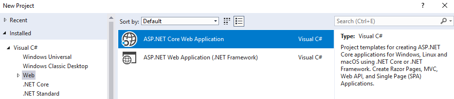

## Step 2.) Select "**API**" as the Project Template, also selecting ASP.NET Core.

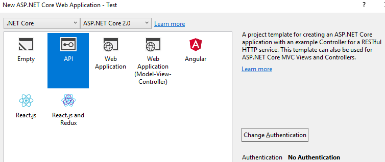

## Step 3.) Add a Controller and your first Data Model.

Start off by creating any simple data model class to store primitive values.

```cs
    [Serializable]
    public class Item
    {
        public string Name;
        public double Weight;
    }
```

Add a new Controller Class to the **Controllers** folder.

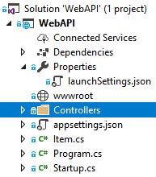

Make sure you select the Controller Type as "**API**".

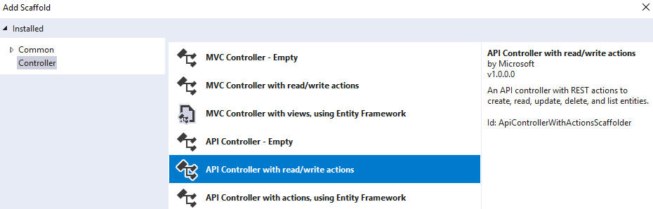

You can start with a simple **Controller** that only has a ***Get*** method.

>### Note:
>* You must specify the **Route** (URL) to the Controller.  *(api/Items)*
>* You must specify the data type the Controller **Produces**.  *(application/json)*
>* Returning *only* a primitive value is ironically complicated, so stick with using objects.

```cs
    [Route("api/Items")]
    [Produces("application/json")]
    public class ItemsController : Controller
    {
        [HttpGet]
        public Item Get()
        {
            return new Item()
            {
                Name = "Thing",
                Weight = 100.5
            };
        }
    }
```

With your Controller complete, you can launch your API and direct your browser to it.

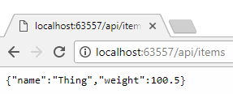

Keep in mind that your **launchSettings.json** file controls the location of your API.

*(That's where the mysterious localhost port number comes from...)*

```json
    "WebAPI": {
      "commandName": "Project",
      "launchBrowser": true,
      "launchUrl": "api/items",
      "environmentVariables": {
        "ASPNETCORE_ENVIRONMENT": "Development"
      },
      "applicationUrl": "http://localhost:63557/"
    }
```

## Step 4.) Incorporate MVC into your project for more sophisticated testing.

>### Note:
>* You could use a 3rd party application to test your API further, such as a REST API Client.
>* I find it much more convenient to build a test page directly into the Visual Studio project.

Add another new Controller Class to the **Controllers** folder.


Make sure you select the Controller Type as "**MVC**".

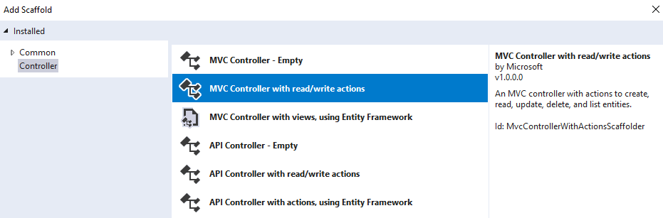

Name this Controller something generic, like "*Home*", and do not modify the default code.

```cs
    public class HomeController : Controller
    {
        public IActionResult Index()
        {
            return View();
        }
    }
```

Add a root level folder "Views" with a sub-folder with the same Controller name you used. ("*Home*")

Right click on ***/Views/Home*** in the Solution Explorer and select Add New View. Name it "Index".

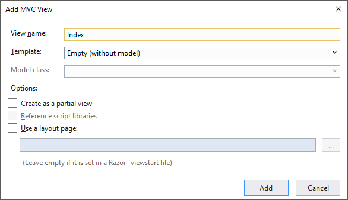

Your folder structure should now look like this.

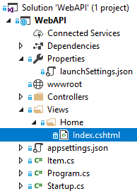

### Now we have to do a little house keeping.

Update your ***launchSettings.json*** file to use your new **Home** View as the ***launchUrl***.

```json
    "WebAPI": {
      "commandName": "Project",
      "launchBrowser": true,
      "launchUrl": "Home",
      "environmentVariables": {
        "ASPNETCORE_ENVIRONMENT": "Development"
      },
      "applicationUrl": "http://localhost:63558/"
    }
```

Add **MVC** to your ***ConfigureServices*** method in **Startup.cs**.

```cs
    public void ConfigureServices(IServiceCollection services)
    {
        services.AddMvc();                  // Needed for MVC.
    }
```

Add **MVC** to your ***Configure*** method in **Startup.cs**.

```cs
    public void Configure(IApplicationBuilder app, IHostingEnvironment env)
    {
        if (env.IsDevelopment())
        {
            app.UseDeveloperExceptionPage();
        }

        app.UseMvc(routes =>                // Needed for MVC.
        {
            routes.MapRoute(
                name: "default",
                template: "{controller=Home}/{action=Index}/{id?}");
        });
    }
```

I guess we should also probably put some actual HTML in the View. :)

```html
<!-- Views/Home/Index.cshtml -->

<html>
    <body>
        <div>
            Hello World!
        </div>
    </body>
</html>
```

We now will see our Test Page (Home) launch when we run our API.

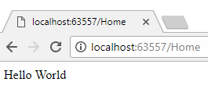

## Step 5.) Use our Test Page to do a POST to our API.

First, let's actually go back to our ItemsController and add a POST method.

```cs
    [HttpPost]
    public void Post([FromBody]Item item)
    {
        // Do whatever you want with the item object.
    }
```

Writing front-end script is a little tedious, but we can use JQuery.ajax to easily POST an Item to our new API method.

*(It's even easier if you just hard code the data, but I decided to let the user input it for better testing)*

```html
<!-- Views/Home/Index.cshtml -->

<html>
    <body>

        <script src="https://ajax.googleapis.com/ajax/libs/jquery/3.3.1/jquery.min.js"></script>

        <script>
            $(document).ready(function () {
                $(".item-button").click(function () {
                    $.ajax({
                        headers: { 'Content-Type': 'application/json' },
                        'type': 'POST',
                        'url': "api/items",
                        'data': JSON.stringify( {
                            'Name': $(".item-name").val(),
                            'Weight': parseFloat($(".item-weight").val()) } ),
                        complete: function (xhr, textStatus) {
                            alert("Response Code: " + xhr.status);
                        }
                    });
                });
            });
        </script>

        <input class="item-name" type="text" value="" /> (Item Name) <br />
        <input class="item-weight" type="text" value="" /> (Item Weight) <br />
        <input class="item-button" type="button" value="POST" /><br />

    </body>
</html>
```

Now just launch the test page and POST to the API.

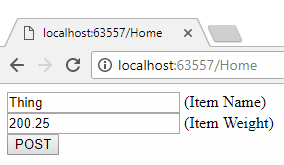

Your Controller POST method should receive the de-serialized object with the correct values. Magic!

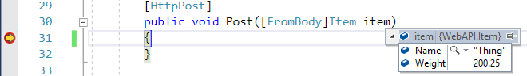

## Step 6.) Adding Session

### Here we go again, back to the **Startup.cs** code to add support for persistant **Session Data**.

> ### Note
> * Without adding **Session** and **Cookies**, each API request is ***Connectionless***.
> * This means two subsequent requests cannot be attributed to the same client.
> * This is the reason we implement **Session** and **Cookies**; to identify unique clients.

Add **Session** to your ***ConfigureServices*** method in **Startup.cs**.

```cs
    public void ConfigureServices(IServiceCollection services)
    {
        services.AddMvc();
        services.AddSession();              // Needed for Session.
    }
```

Add **Session** to your ***Configure*** method in **Startup.cs**.

```cs
    public void Configure(IApplicationBuilder app, IHostingEnvironment env)
    {
        if (env.IsDevelopment())
        {
            app.UseDeveloperExceptionPage();
        }

        app.UseSession();                   // Needed for Session.
        app.UseMvc(routes =>
        {
            routes.MapRoute(
                name: "default",
                template: "{controller=Home}/{action=Index}/{id?}");
        });
    }
```

## Step 7.) Testing Persistent Session Data

### Let's try to **POST** an Item and try to retrieve it with a subsequent **GET**.

Notice we are augmenting our controller to save the item to Session when we POST it.

This will allow us to retrieve it later, since the Session can identify us a unique client.

```cs
    using Microsoft.AspNetCore.Http;
    using Microsoft.AspNetCore.Mvc;
    using Newtonsoft.Json;

    namespace WebAPI.Controllers
    {
        [Produces("application/json")]
        [Route("api/Items")]
        public class ItemsController : Controller
        {
            [HttpGet]
            public Item Get()
            {
                // Get Session data that is specific to our unique client.
                var data = HttpContext.Session.GetString("uniqueKey");
                var item = JsonConvert.DeserializeObject<Item>(data);
                return item;
            }

            [HttpPost]
            public void Post([FromBody]Item item)
            {
                // Save to Session, accessible to requests made only by our unique client.
                HttpContext.Session.SetString("uniqueKey", JsonConvert.SerializeObject(item));
            }
        }
    }
```
### Remember that POST we did before? Now we can follow it up with a GET!

This is live Web API Server Session Data being retrieved based on our unique client request.

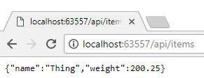

## Step 8.) Collections, Indexing, and Parameters

### I won't go into to much detail because this stuff is fairly easy.

* ### Collections
  * You can change the return types in the Controller to use Collections like System.Collections.Generic.List.
* ### Indexing
  * For collections you can access them directly through the URL with indexing.
    ```cs
            [HttpGet("{index}", Name = "Get")]
            public List<Item> Get(int index)
            {
                var data = HttpContext.Session.GetString("uniqueKey");
                var items = JsonConvert.DeserializeObject<List<Item>>(data);
                return items[index];
            }
    ```

  
* ### Parameters
  * You can use URL parameters to to pretty much anything.
  * Just don't use them as an easy, hacky way to do things that may be better with a different controller.

    ## localhost:63557/api/items?maxWeight=100
```cs
        using System.Linq;

        [HttpGet]
        public List<Item> Get()
        {
            // Retrieve the value of "maxWeight" from the URL Request.
            string maxWeight = HttpContext.Request.Query["maxWeight"];
            if (string.IsNullOrEmpty(maxWeight)) return items;
            float max = float.Parse(HttpContext.Request.Query["maxWeight"]);

            // This will filter out all the items that are heavier than the max weight.
            return items.Where(item => { return item.Weight < max; }).ToList();
        }
```

# Step 9.) Do More Stuff!

### This WebAPI is just to show you how to get started. For some more advanced examples, see my other solution in this same code repository on github.

 * https://github.com/DonnieSantos/WebAPI/tree/master/WebAPI%20Basics
 * https://github.com/DonnieSantos/WebAPI/tree/master/MyWebAPI

# Credits

* **Donald J. Santos**
* Lead Software Developer, Progressive Insurance Mobile Native Apps
* http://www.github.com/donniesantos
* https://www.youtube.com/channel/UCFb08xSV43hIGvDSpdSrBvw/featured?view_as=subscriber
