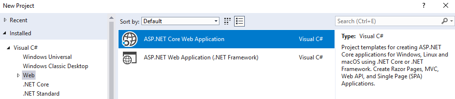
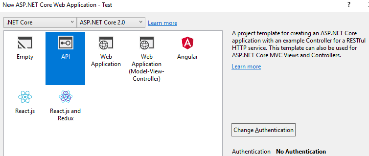
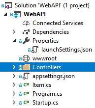
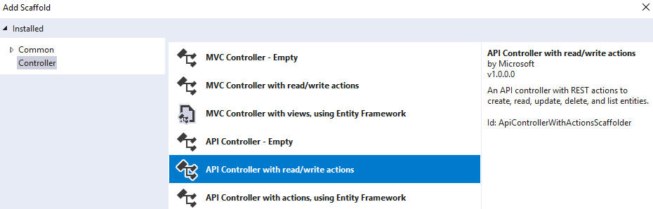
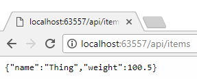
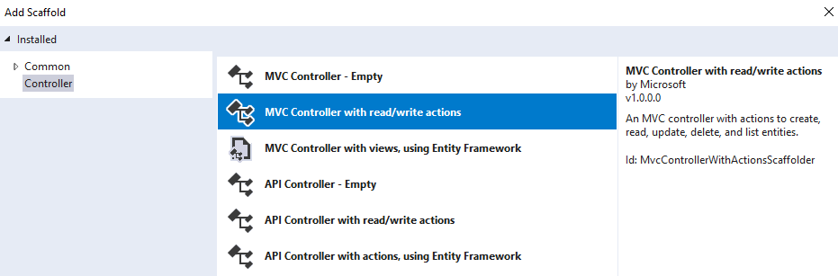
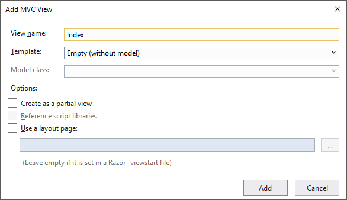
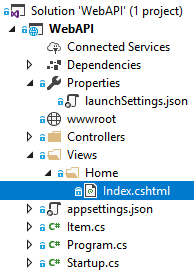
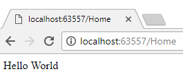

# Microsoft .NET Web API Tutorial

## Step 1.) In Visual Studio 2017, create a new ASP.NET Core Web Application.



## Step 2.) Select "**API**" as the Project Template, also selecting ASP.NET Core.



## Step 3.) Add a Controller and your first Data Model.

Start off by creating any simple data model class to store primitive values.

```cs
    [Serializable]
    public class Item
    {
        public string Name;
        public double Weight;
    }
```

Add a new Controller Class to the **Controllers** folder.



Make sure you select the Controller Type as "**API**".



You can start with a simple **Controller** that only has a ***Get*** method.

>### Note:
>* You must specify the **Route** (URL) to the Controller.  *(api/Items)*
>* You must specify the data type the Controller **Produces**.  *(application/json)*
>* Returning *only* a primitive value is ironically complicated, so stick with using objects.

```cs
    [Route("api/Items")]
    [Produces("application/json")]
    public class ItemsController : Controller
    {
        [HttpGet]
        public Item Get()
        {
            return new Item()
            {
                Name = "Thing",
                Weight = 100.5
            };
        }
    }
```

With your Controller complete, you can launch your API and direct your browser to it.



Keep in mind that your **launchSettings.json** file controls the location of your API.

*(That's where the mysterious localhost port number comes from...)*

```json
    "WebAPI": {
      "commandName": "Project",
      "launchBrowser": true,
      "launchUrl": "api/items",
      "environmentVariables": {
        "ASPNETCORE_ENVIRONMENT": "Development"
      },
      "applicationUrl": "http://localhost:63557/"
    }
```

## Step 4.) Incorporate MVC into your project for more sophisticated testing.

>### Note:
>* You could use a 3rd party application to test your API further, such as a REST API Client.
>* I find it much more convenient to build a test page directly into the Visual Studio project.

Add another new Controller Class to the **Controllers** folder.


Make sure you select the Controller Type as "**MVC**".



Name this Controller something generic, like "*Home*", and do not modify the default code.

```cs
    public class HomeController : Controller
    {
        public IActionResult Index()
        {
            return View();
        }
    }
```

Add a root level folder "Views" with a sub-folder with the same Controller name you used. ("*Home*")

Right click on ***/Views/Home*** in the Solution Explorer and select Add New View. Name it "Index".



Your folder structure should now look like this.



Update your ***launchSettings.json*** file to use your new **Home** View as the ***launchUrl***.

```json
    "WebAPI": {
      "commandName": "Project",
      "launchBrowser": true,
      "launchUrl": "Home",
      "environmentVariables": {
        "ASPNETCORE_ENVIRONMENT": "Development"
      },
      "applicationUrl": "http://localhost:63558/"
    }
```

Add MVC and Session to your ***ConfigureServices*** method in **Startup.cs**.

```cs
    public void ConfigureServices(IServiceCollection services)
    {
        services.AddMvc();                  // Needed for MVC.
        services.AddSession();              // Needed for Session.
    }
```

Add MVC and Session to your ***Configure*** method in **Startup.cs**.

```cs
    public void Configure(IApplicationBuilder app, IHostingEnvironment env)
    {
        if (env.IsDevelopment())
        {
            app.UseDeveloperExceptionPage();
        }

        app.UseSession();                   // Needed for Session.
        app.UseMvc(routes =>                // Needed for MVC.
        {
            routes.MapRoute(
                name: "default",
                template: "{controller=Home}/{action=Index}/{id?}");
        });
    }
```

I guess we should also probably put some actual HTML in the View. :)

```html
<!-- Views/Home/Index.cshtml -->

<html>
    <body>
        <div>
            Hello World!
        </div>
    </body>
</html>
```

We now will see our Test Page (Home) launch when we run our API.



## Step 5.) Use our Test Page to do a POST to our API.

```html
<!-- Views/Home/Index.cshtml -->

<html>
    <body>

    	<script src="https://ajax.googleapis.com/ajax/libs/jquery/3.3.1/jquery.min.js"></script>

        <script>
    	    $.ajax({
                headers: { 'Content-Type': 'application/json' },
                'type': 'POST',
                'url': "api/items",
                'data': JSON.stringify( {
                    'Name': $(".item-name").val(),
                    'Weight': parseFloat($(".item-weight").val()) } )
	        });
        </script>
        
    </body>
</html>
```